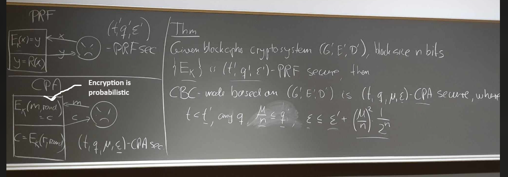

# Which 3 sets define a cryptosystems values?

- The key space $\keyspace$  
- The plaintext space $\plainspace$  
- The ciphertext space $\cipherspace$  

# Which 3 algorithms define a cryptosystem?

- $G \rightarrow K \in \keyspace$ ($G$enerates keys): Probabilistic. Usually uniform in $\keyspace$.  
- $E: E_K(x) = y \in \cipherspace$ ($E$ncrypts plaintexts): (Probabilistic). Ciphertext's probability distribution is determined by $K$ and $x$, typically uniform in some subset of the ciphertexts.  
- $D: D_K(y) = x \in \plainspace$ ($D$ecrypts ciphertexts): (Probabilistic)  

# Which relationship between the algorithms do we require for all cryptosystems?

For any $x \in \plainspace$, $x = D_K(E_K(x))$ 
**TLDR:** For any key $\textit{K}$ output by $\textit{G}$, correct decryption is possible.  

# What is the definition of PRF-security?

**Short definition:**  
$\left\{f_K \mid K \in\{0,1\}^k\right\}$ is $(t, q, \epsilon)$ PRF-secure if $Adv_A\left(O_{\text {Real }}, O_{\text {Ideal }}\right) \leq \epsilon$  

**Formal definition:**  
We say that $\left\{f_K \mid K \in\{0,1\}^k\right\}$ is $(t, q, \epsilon)$ PRF-secure, if any adversary $A$ that runs in time at most $t$ and makes at most $q$ queries to the oracle, satisfies $Adv_A\left(O_{\text {Real }}, O_{\text {Ideal }}\right) \leq \epsilon$

Where $\left\{f_K \mid K \in\{0,1\}^k\right\}$ denotes a family of functions mapping $\plainspace \rightarrow \cipherspace$. For a symmetric and deterministic encryption scheme $f_K$ is replaced by $E_K$. (Just like the set of all DES functions. Each $f_K: \{0,1\}^n \rightarrow \{0,1\}^m$. The advantage is defined as $Adv_A\left(O_{\text {Real }}, O_{\text {Ideal }}\right) = |p(A,0) - p(A,1)|$.)

# What is the definition of CPA-security?

**Short definition:** $(G, E, D)$ is $(t, q, \mu, \epsilon)$ CPA-secure if $\operatorname{Adv}_A\left(O_{\text {Real }}, O_{\text {Ideal }}\right) \leq \epsilon$

**Formal definition:** We say the cryptosystem $(G, E, D)$ is $(t, q, \mu, \epsilon)$ CPA-secure, if for any adversary $A$ that runs in time at most $t$, and makes at most $q$ queries to the oracle, with plaintexts consisting of a total of $\mu$ bits, it holds that $\operatorname{Adv}_A\left(O_{\text {Real }}, O_{\text {Ideal }}\right) \leq \epsilon$.

# Draw the PRF game

# Draw the CPA game

# Draw the Hybrid game

(Does normal CBC, except $E_K$ is replaced by R, where R only takes and outputs bit strings of length n)

# How is the CBC theorem defined?

**Theorem:**
    If $(G, E, D)$ is $\left(t, q, \epsilon\right)$ PRF-secure then $(G', E', D')$ using CBC is $(t^{\prime}, q^{\prime} \mu, \epsilon^{\prime})$ CPA-secure for any $q^{\prime}$, and for
$$
\epsilon^{\prime}=\epsilon+\left(\frac{\mu}{n}\right)^2 \cdot \frac{1}{2^n} = \epsilon+\frac{\mu^2}{n^2\cdot2^n} 
$$
provided that
$$
t^{\prime} \leq t, \quad \frac{\mu}{n} \leq q
$$

# How is the bound on P[BAD] derived (this one needs refinement)?

$\begin{aligned}
  P[M_j] &= 
    P[M_j |M_{j-1}]P[M_{j-1}] + P[M_j | \lnot M_{j-1}]P[\lnot M_{j-1}] 
    &&\text{(Law of Total Probability)}\\
    &\leq P[M_{j-1}] + P[M_j | \lnot M_{j-1}] \\
    &= P[M_{j-1}] + \frac{(j-1)}{2^n}
\end{aligned}$

**Note:**  
The last probability on the right hand side is equal to $\frac{(j-1)}{2^n}$: First, since $M_{j-1}$ did not occur we have seen $j - 1$ different inputs before. Second, the new input nr. $j$ is the XOR of some message block and an independently chosen random block (either a y0-value chosen by the oracle or an output from R), it is therefore uniformly chosen.
We conclude that in fact

$$P[M_j] \leq (1+2+\ldots + (j-1)) \leq \frac{j^2}{2^n}$$

Now we've provided a bound for all j's (calls to R).
Since the total number of calls is at most $\mu/n$, we can replace j with $\mu/n$. Thus it follows that $P(BAD) \leq \frac{\mu^2}{n^2\cdot2^n}$ and we are done.
