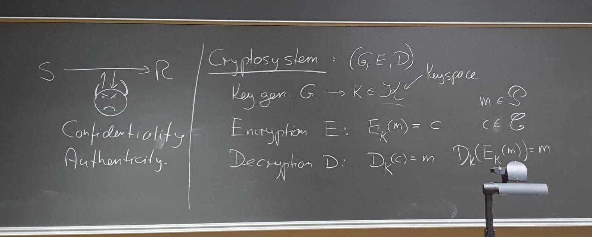

Note that these notes are based on the 2023v3 version of the cryptography book.

\setcounter{secnumdepth}{0}
\setcounter{tocdepth}{3}
\tableofcontents
\pagebreak

\newpage

# Curriculum

This is an excerpt of useful information from the professor on the exam,
for this semester.

**Background material:**

Chapters 2+3 (preliminary probability theory and math), Section 5.4
(optimistic results on key exchange), Section 6.3 (diff and lin analysis),
Proof of Theorem 7.8 (if you can get the secret exponent you can factor),
Section 7.6.1 (factoring algorithms), Section 9.6 (discrete log algorithms).

**Grading:**

Your grade is based on an overall assessment of you performance at the exam
and your hand-in exercises (which count for 20%) .

Here are some details on what you might for instance cover in each the exam
subject. But do not misunderstand this in the sense that you have to follow
the templates below, they really are just examples...

**Information theory and Cryptography:**

Definition of perfect secret security, why you need as many keys at plaintexts
to have perfect security. Definition of entropy, and proof of some of the
inequalities properties it satisfies. Unicity distance (but be careful,
this may take a lot of time, so test this beforehand)

**Symmetric (secret-key) cryptography:**

What a crypto-system is (the three algorithms) You can describe DES or AES -
but you can also just give a high-level description of what a block cipher
is. Definitions of PRF and CPA security. Specification of CBC or CTR modes
(or both), proofs of CPA security for CBC or CTR mode (or both). Perhaps a
brief talk about stream ciphers and how to make one from a block cipher.

**Public-key cryptography from Factoring:**

What a public-key cryptosystem is. Basic spec of RSA, maybe proof that
decryption works. Then some selection of the following: How to make RSA be CPA
secure (the PCRSA scheme, and the result that computing the least significant
bit is as hard as inverting RSA). How to generate keys and Miller-Rabin
primality testing, how to get CCA security: OAEP and the intuition on why
it works.

**Public-key cryptography based on discrete log and LWE:**

The DL, DH and DDH problems, and how they relate. The El Gamal cryptosystem
and proof that it is secure if DDH is hard. Then some example of groups we
can use, can be a subgroup of $\Z_p^*$, or you can talk about elliptic curves. You
can also put less emphasis on El Gamal, for instance skip the example groups
and go to LWE instead, define the problem and the cryptosystem and do the
proof from the exercise that decryption works under a certain assumption
about the noise distribution.

**Symmetric authentication and hash functions:**

Definition of collision-intractable hash functions. Then a selection of:
construction from discrete log, proof that collision-intractable implies
one-way, construction and proof that we can get any size input from fixed
size input. Finally, MAC schemes, definition of CMA security, CBCMAC and
EMAC security result for EMAC. Maybe a brief mention of HMAC.

**Signature schemes:**

Definition of signatures schemes and of CMA security. The Schnorr signature
scheme, you can do many details here, such as the proof that you cannot
cheat the underlying interactive game with better than 1/q probability, and
the full story on how you derive the signature scheme from the interactive
game. Or you can just do the spec of the scheme, giving you time for something
else, such as RSA+hash signatures and the proof that secure hash + secure
signature scheme is secure. Or you can do the one-time signatures based on
hash functions and the proof that they are secure.

\newpage

# Information theory and Cryptography (Chapter 5)

## Disposition (Kirk)

<!-- TODO: Add subbullets -->
- Perfect Security
- Entropy
- Unicity Distance

## Disposition (Berg)

## Notes

### Perfect Security

Below we have the definition for perfect security:

**Definition 5.1:** A cryptosystem has perfect security if for all $x \in
\plainspace$ and $y \in \cipherspace$, it holds that $P[x|y] = P[x].$  
**TLDR:** Information about the ciphertext gives you _no_ information about
the plaintext.

Why do you need as many plaintexts as ciphertexts under perfect security?

$|\cipherspace| \geq |\plainspace|$: This is true for all crypto systems in
order for decryption to function correctly.

$|\keyspace| \geq |\cipherspace|$: For a fixed plaintext $x$ must be able to
hit every ciphertext $y$, otherwise an adversary could conclude that $E(x)
\neq y$ and therefore learn information from $y$.

Therefore $|\keyspace| \geq |\cipherspace| \geq |\plainspace|$.

### Entropy

**Definition 5.6:** Let $X$ be a random variable that takes values $x_1,
..., x_n$ with probabilities $p_1, ..., p_n.$ Then the entropy of $X$,
written $H(X)$, is defined to be:
$$H(X) = \sum^n_{i=1} p_i \log_2(1/p_i)$$
**TLDR:** If an event $A$ occurs with probability $p$ and you are told that
$A$ occurred, then you have learned $\log_2(1/p)$ bits of information

\newpage

# Symmetric (secret-key) cryptography (Chapter 4.1 + 6)
## Disposition (Kirk)

<!-- TODO: Add subbullets -->
- Definitely AES
- PRF and CPA security
- CBC/CTR
- CPA security proof for CBC/CTR
- At least understand the block cipher...

## Disposition (Berg)
- Symmetric Cryptosystem definition (chap 4.1)
- DES definition
  - Feistel ciphers
- AES definition 
- (High level definition of Block Ciphers)
- PRF security 
- CPA security 
- CBC mode
- CTR mode 
- Stream ciphers 
- (Differential & Linear Cryptanalysis)

## Notes

### Symmetric Cryptosystems

(Optionally something related to confidentiality and authenticity)

For a symmetric system, there are 3 finite sets given; the key
space $\kappa$, the plaintext space $\rho$ and the ciphertext space $\cipherspace$.

\newpage

# Public-key cryptography from Factoring (Chapter 7 & 8)
## Disposition (Kirk)

## Disposition (Berg)

## Notes

\newpage

# Public-key cryptography based on discrete log and LWE (Chapter 9 & 10, definition of CPS security in chapter 8)
## Disposition (Kirk)

## Disposition (Berg)

## Notes

\newpage

# Symmetric authentication and hash functions (Chapter 11)
## Disposition (Kirk)

## Disposition (Berg)

## Notes

\newpage

# Signature schemes (Chapter 12)
## Disposition (Kirk)

## Disposition (Berg)

## Notes

\newpage

