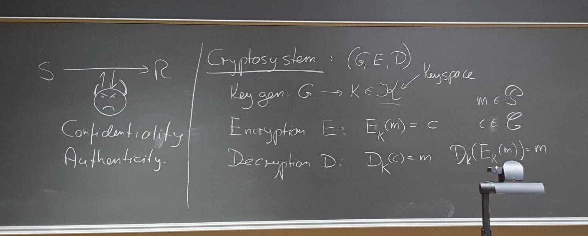
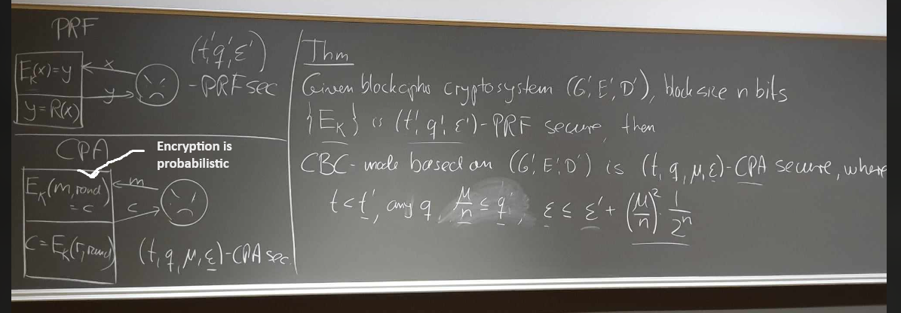
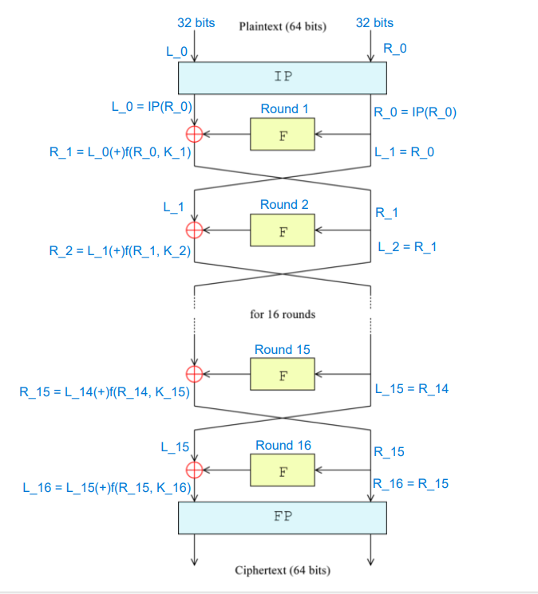
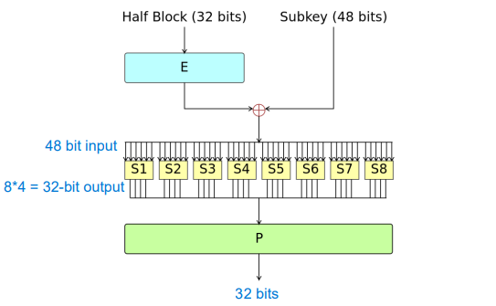

Note that these notes are based on the 2023v3 version of the cryptography book.

\setcounter{secnumdepth}{0}
\setcounter{tocdepth}{3}
\tableofcontents
\pagebreak

\newpage

# Curriculum

**Background material:**

Chapters 2+3 (preliminary probability theory and math), Section 5.4
(optimistic results on key exchange), Section 6.3 (diff and lin analysis),
Proof of Theorem 7.8 (if you can get the secret exponent you can factor),
Section 7.6.1 (factoring algorithms), Section 9.6 (discrete log algorithms).

**Example Templates:**

Here are some details on what you might for instance cover in each the exam
subject. But do not misunderstand this in the sense that you have to follow
the templates below, they really are just examples...

**Information theory and Cryptography:**

Definition of perfect secret security, why you need as many keys at plaintexts
to have perfect security. Definition of entropy, and proof of some of the
inequalities properties it satisfies. Unicity distance (but be careful,
this may take a lot of time, so test this beforehand)

**Symmetric (secret-key) cryptography:**

What a crypto-system is (the three algorithms) You can describe DES or AES -
but you can also just give a high-level description of what a block cipher
is. Definitions of PRF and CPA security. Specification of CBC or CTR modes
(or both), proofs of CPA security for CBC or CTR mode (or both). Perhaps a
brief talk about stream ciphers and how to make one from a block cipher.

**Public-key cryptography from Factoring:**

What a public-key cryptosystem is. Basic spec of RSA, maybe proof that
decryption works. Then some selection of the following: How to make RSA be CPA
secure (the PCRSA scheme, and the result that computing the least significant
bit is as hard as inverting RSA). How to generate keys and Miller-Rabin
primality testing, how to get CCA security: OAEP and the intuition on why
it works.

**Public-key cryptography based on discrete log and LWE:**

The DL, DH and DDH problems, and how they relate. The El Gamal cryptosystem
and proof that it is secure if DDH is hard. Then some example of groups we
can use, can be a subgroup of $\Z_p^*$, or you can talk about elliptic curves. You
can also put less emphasis on El Gamal, for instance skip the example groups
and go to LWE instead, define the problem and the cryptosystem and do the
proof from the exercise that decryption works under a certain assumption
about the noise distribution.

**Symmetric authentication and hash functions:**

Definition of collision-intractable hash functions. Then a selection of:
construction from discrete log, proof that collision-intractable implies
one-way, construction and proof that we can get any size input from fixed
size input. Finally, MAC schemes, definition of CMA security, CBCMAC and
EMAC security result for EMAC. Maybe a brief mention of HMAC.

**Signature schemes:**

Definition of signatures schemes and of CMA security. The Schnorr signature
scheme, you can do many details here, such as the proof that you cannot
cheat the underlying interactive game with better than 1/q probability, and
the full story on how you derive the signature scheme from the interactive
game. Or you can just do the spec of the scheme, giving you time for something
else, such as RSA+hash signatures and the proof that secure hash + secure
signature scheme is secure. Or you can do the one-time signatures based on
hash functions and the proof that they are secure.

\newpage

# Basic Facts from Probability Theory

**Theorem 2.4 (Jensen's inequality):** Let $p_1, ..., p_n$ be a probability
distribution, that is, $\sum_i p_i = 1$ and $0 \leq p_i \leq 1$. Then for
any concave $f$ and any $x_1, .., x_n$, we have:

$$\sum^n_{i=1} p_i f(x_i) \leq f(\sum^n_{i=1} p_i x_i)$$

Furthermore, if $f$ is strictly concave, equality holds **iff** all the
$x_i$'s are equal.  
**TLDR: $f(\E[X]) \leq \E[f(X)]$**

**Note:** _Concave_ means that $\frac{f(a) + f(b)}{2} \leq \frac{a + b}{2}$.  
**TLDR:** $f'' = 0$.

**Note:** _Strictly concave_ means that $\frac{f(a) + f(b)}{2} < \frac{a +
b}{2}$ for all $a \neq b$.  
**TLDR:** This basically means that graph of the function always curves and
is never linear.

**Note:** For this course, we only apply this to $\log()$ which is strictly
concave.
$\enddef$

\pagebreak

# Information theory and Cryptography (Chapter 5)

**Disposition (Kirk):**

<!-- TODO: Add subbullets -->
- Perfect Security
- Entropy
- Unicity Distance

**Disposition (Berg):**

## Perfect Security

Below we have the definition for perfect security:

**Definition 5.1:** A cryptosystem has perfect security if for all $x \in
\plainspace$ and $y \in \cipherspace$, it holds that $P[x|y] = P[x].$  
**TLDR:** Information about the ciphertext gives you _no_ information about
the plaintext.
$\enddef$

**Theorem - $|\keyspace| \geq |\cipherspace| \geq |\plainspace|$:** If you have
perfect security then $|\keyspace| \geq |\cipherspace| \geq |\plainspace|$.  
**TLDR:** If you have perfect security your key can not be shorter than your
ciphertext, which cannot be shorter than your plaintext.
$\enddef$

_Proof:_

- $|\cipherspace| \geq |\plainspace|$: This is true for all crypto systems in
order for decryption to function correctly.

- $|\keyspace| \geq |\cipherspace|$: For a fixed plaintext $x$ must be able to
hit every ciphertext $y$, otherwise an adversary could conclude that $E(x)
\neq y$ and therefore learn information from $y$.

Therefore, given perfect security, you have $|\keyspace| \geq |\cipherspace|
\geq |\plainspace|$.
$\qed$

## Entropy

> _As a further illustration of the intuition behind entropy, consider
  the following thought experiment: suppose you get access to an oracle that
  will magically tell you if you will live to be more than 110 years old. One
  would naturally expect that the probability p of getting “yes” as the
  answer is very small, while the probability $1 - p$ of "no" is close to 1._

**Definition 5.6:** Let $X$ be a random variable that takes values $x_1,
..., x_n$ with probabilities $p_1, ..., p_n.$ Then the entropy of $X$,
written $H(X)$, is defined to be: 
$$H(X) = \sum^n_{i=1} p_i \log_2(1/p_i)$$
**TLDR:** If an event $A$ occurs with probability $p$ and you are told that
$A$ occurred, then you have learned $\log_2(1/p)$ bits of information.
**TLDR:** The entropy $H(X)$ can be described as: 

- How many bits we need to send on average to communicate the value of $X$.
- The amount of uncertainty you have about $X$ before you are told what the
  value is.
$\enddef$

**Theorem 5.7:** For a random variable $X$ taking $n$ possible values, it
holds that $0 \leq H(X) \leq \log_2(n)$. Furthermore, $H(X) = 0$ **iff**
one value $X$ has probability 1 (and the others 0). $H(X) = log_2(n)$ **iff**
it is uniformly distributed, i.e., all probabilities are $1/n$.  
**TLDR:** If the entropy of $X$ is 0 there is no uncertainty, meaning that
we know the value of $X$. If the entropy of $X$ is 1 then the uncertainty
of $X$ is highest meaning that all possible values of $X$ have the same
probability.
$\enddef$

_Proof:_ We need to prove the following:

- $H(X) > 0$
  - $H(X)$ is defined as a product of positive sums, therefore $H(X)$ is also positive.
- $H(X) = 0$ **iff** a single $p_i = 1$ and all other $p_j = 0$
  - The function $f(p) = p \log(1/p)$ is only 0 if $p = 0 \lor p = 1$. This
    coupled with the fact that probabilities must sum up to one means that 
    $H(X) = 0$ **iff** a single $p_i = 1$ and all other $p_j = 0$.
- $H(X) < \log_2(n)$
  - $\log$ is a concave function ($\log'' = 0$) therefore we can use Theorem
    2.4 (Jensen's inequality):  
    $$H(X) = \sum^n_{i=1} p_i \log_2(1/p_i) \leq \log_2(\sum^n_{i=1} p_i \cdot 1/p_i) = \log_2(n)$$  
    Thus $H(X) < \log_2(n)$.
- $H(X) = \log_2(n)$ **iff** $X$ is uniformly distributed.
  - Since $log_2$ is strictly concave then from Theorem 2.4 we know
    that $H(X) = \log_2(n)$ **iff** all $p_i$ are equal i.e. $X$ is uniformly
    distributed.
$\qed$

## Conditional Entropy

<!-- TODO: Above definition? lol -->

**Definition 5.9:** Given the above definition of $H(X \;|\;Y = y_j)$, we define
the conditional entropy of X given Y to be:
$$H(X \;|\; Y) = \sum_j P[Y = y_j] H(X \;|\; Y = y_j)$$

## Entropy of Random Variables in Cryptography

**Theorem 5.11:** For any cryptosystem with deterministic encryption function, it
holds that:
$$H(K \;|\; C) = H(K) + H(P) - H(C)$$
**TLDR:** Answers how much uncertainty remains about the key given the ciphertext
<!-- TODO: Include Proof? -->

## Unicity Distance

**Definition - Redundancy:** Given a language $L$ and a plaintext space $\plainspace$,
the _redundancy_ of the language is the amount of superflous information is
contained, on avarage in the language $L$.
$$R_L = \frac{\log(|\plainspace|) - H_L}{\log(|\plainspace|)} = 1 - \frac{H_L}{\log(|\plainspace|)}$$
$H_L$ is a measure of the number of bits of information each letter contains
in the language $L$, on average. For English, we have that $H_L$ is (very
approximately) 1.25 bits per letter.
$$H_L = \lim_{n \mapsto \infty} H(P_n)/n$$  
**TLDR:** A language contains redundancy, which is how much duplicate
information there is on avarage in the language.  
**Example:** The following sentance displays redundancy in english:

> _"cn y rd th fllwng sntnc, vn f t s wrttn wtht vcls?"_

$\enddef$

**Definition - Spurious Keys:** If an adversary has a ciphertext $y$ that
he wants to decrypt, he can try all keys and see if $y$ decrypts to meaningful
english. If $y$ decrypts to meaningful english under the _wrong_ key, then
that key is said to be a _spurious key._  
**TLDR:** A spurious key is a key that _seems_ to be the correct key for a
ciphertext but is not.
$\enddef$

**Definition - Number of Spurious Keys:** The average number of
spurious keys, taken over all choices of ciphertexts of length $n$: 
$$sp_n = \sum_{\vec{y} \in \cipherspace^n} P[y](|K(\vec{y})| - 1) = \sum_{\vec{y} \in \cipherspace^n} P[y]|K(\vec{y})| - 1$$
Given a ciphertext $\vec{y}$, we use $K(\vec{y})$ to denote the set of keys
that are possible given this ciphertext. More precisely, a key $K$ is in
this set if decryption of $\vec{y}$ under $K$ yields a plaintext that could
occur with non-zero probability:
$$K(\vec{y}) = \{ K \in \keyspace \; | \; P[D_K(\vec{y} > 0)]\}$$
**TLDR:** This formula for $sp_n$ describes the average number of spurious
keys of a ciphertext $\vec{y}$ of length $n$.

$\enddef$

**Definition 5.12:** The unicity distance $n_0$ of a cryptosystem is the
minimal length of plaintexts such that $sp_{n_0} = 0$, if such a value exists,
and $\infty$ otherwise.  
**TLDR:** The unicity distance tells you how many times you can encrypt
something where multiple keys seem to be valid keys.
$\enddef$

**Theorem 5.13:** Assume we have a cryptosystem with deterministic encryption
function, where the plaintext and ciphertext alphabets have the same size
$(|\cipherspace| = |\plainspace|)$, and where keys are uniformly chosen from
$\keyspace$. Assume we use the system to encrypt sequences of letters from
language $L$. Then
$$n_0 \geq \frac{\log(|\keyspace|)}{R_L \log(|\plainspace|)}$$
**TLDR:** If we reuse keys, our unconditional security will always be gone,
once we encrypt enough plaintext under the same key. The only exception is
the case where $R_L = 0$ which leads to $n_0$ being $\infty$. Which makes
sense, if every sequence of characters is a plaintext that can occur, the
adversary can never exclude a key.
$\enddef$

**Proof:** We start by unfolding the definition of $H(K \;|\; C_n)$ using Definition 5.9:

$$H(K \;|\; C_n) = \sum_{\vec{y \in \cipherspace_n}} P[C_n = \vec{y}] H(K \;|\;C_n = \vec{y})$$

First, note that given some ciphertext $\vec{y}$, the key $K$ will have
some conditional distribution, but of course only values in $K(\vec{y})$
can occur. Therefore $H(K|C_n = \vec{y}) \leq \log_2(|K(\vec{y})|)$:

$$
\begin{aligned}
  H(K \;|\; C_n)
    &\leq 
      \sum_{\vec{y \in \cipherspace_n}} P[C_n = \vec{y}] \log_2(|K(\vec{y})|) \\
    &\leq \log_2 \left(\sum_{\vec{y \in \cipherspace_n}} P[C_n = \vec{y}] |K(\vec{y})|\right) 
      && \text{(Definition 2.4 - Jensen's Inequality)} \\
    &\leq \log_2(sp_n + 1)
      && \text{(Definition - Number of Spurious Keys)} \\
\end{aligned}
$$

Now we want to simplify $H(K \;|\; C_n)$. We start by applying Theorem 5.11:
$$H(K \;|\; C_n) = H(K) + H(P_n) - H(C_n)$$

Observe that $H(C_n) \geq log(|C|^n) = n \log(|\plainspace|)$. Moreover,
recalling the definition on $H_L$, let us assume that we take $n$ large
enough so that $H(P_n) \approx nH_L$.
$$
\begin{aligned}
  H(P_n) &\approx nH_L \\
    &\approx n (\log(|\plainspace|)(1-R_L))
      && \text{(Definition - Number of Spurious Keys)} \\
\end{aligned}
$$

Now we try to find $H(K \;|\; C_n)$

$$
\begin{aligned}
  H(K \;|\; C_n) &= H(K) + H(P_n) - H(C_n) \\
    &\geq H(K) + H(P_n) - n \log(|\plainspace|)
      && \text{(From our observation of $H(C_n)$)} \\
    &\approx H(K) + n \log(|\plainspace|)(1-R_L) - n \log(|\plainspace|)
      && \text{(From our estimate of $H(P_n)$)} \\
    &= H(K) + n \log(|\plainspace|)-n \log(|\plainspace|)R_L - n \log(|\plainspace|) \\
    &= H(K) - n \log(|\plainspace|)R_L \\
    &= \log(|\keyspace|) - n \log(|\plainspace|)R_L 
      && \text{(Theorem 5.7, $K$ is uniform)} \\
    H(K \;|\; C_n) &\geq \log(|\keyspace|) - n \log(|\plainspace|)R_L \\
\end{aligned}
$$

Combining our equations, setting $sp_n = 0$ and solving for $n$:

$$
\begin{aligned}
  \log(|\keyspace|) - n \log(|\plainspace|)R_L &\leq \log_2(sp_n + 1) \\
  \log(|\keyspace|) - n \log(|\plainspace|)R_L &\leq \log_2(0 + 1) \\
   n \log(|\plainspace|)R_L &\leq \log(|\keyspace|) \\
   n &\leq \frac{\log(|\keyspace|)}{\log(|\plainspace|)R_L} \\
\end{aligned}
$$

So $n_0 \leq \frac{\log(|\keyspace|)}{\log(|P|)R_L}$.
$\qed$

\newpage

# Symmetric (secret-key) cryptography (Chapter 4.1 + 6)
## Disposition (Kirk)

<!-- TODO: Add subbullets -->
- Definitely AES
- PRF and CPA security
- CBC/CTR
- CPA security proof for CBC/CTR
- At least understand the block cipher...

## Disposition (Berg)
- Symmetric cryptosystems  
  - 3 sets $\rightarrow$ 3 algorithms
- PRF-security 
  - Block ciphers
- CPA-security 
  - CBC 
  - CBC proof 

## Notes

### Symmetric Cryptosystems

(Optionally something related to confidentiality and authenticity)

For a symmetric cryptosystem, we need 3 finite sets which will define all possible values of the system:

- The key space $\keyspace$  
- The plaintext space $\plainspace$  
- The ciphertext space $\cipherspace$  

To generate values from these sets, we must have 3 corresponding algorithms, each responsible for outputting values of a set:  

- $G \rightarrow K \in \keyspace$ (\textit{G}enerates keys): Probabilistic. Usually uniform in $\keyspace$.  
- $E: E_K(x) = y \in \cipherspace$ ($\textit{E}$ncrypts plaintexts): (Probabilistic). Ciphertext's probability distribution is determined by \textit{K} and \textit{x}, typically uniform in some subset of the ciphertexts.  
- $D: D_K(y) = x \in \plainspace$ ($\textit{D}$ecrypts ciphertexts): (Probabilistic)  

This triple of algorithms (G, E, D) constitutes the given cryptosystem.

We always require the following basic relationship between $(G, E, D)$: For any $x \in \plainspace$, $x = D_K(E_K(x))$ 
**TLDR:** For any key $\textit{K}$ output by $\textit{G}$, correct decryption is possible.  
This says nothing about security however.

### PRF Security
In terms of security, we would like the encryption schemes of our system to be $\textit{pseudo}$-randomly secure, meaning that it must act like a pseudo-random function (PRF). In general, a PRF is a function that is inherently $\textit{deterministic}$ but behaves like a $\textit{random}$ one. In order to model this, we say that some adversary plays the following game: _draw PRF Game_

We want the $Adv_A(O_{real}, O_{ideal}) \leq \epsilon$. If this is the case, we say that the probability of him succeeding in an attack on our system is $\textit{negligible}$, meaning we deem it infeasible in practice. 
 
More formally, we want our PRF's to be secure as given by the following definition:  
**Definition - PRF Security:**
    $\left\{f_K \mid K \in\{0,1\}^k\right\}$ is $(t, q, \epsilon)$ PRF-secure if $Adv_A\left(O_{\text {Real }}, O_{\text {Ideal }}\right) \leq \epsilon$  
    (We say that $\left\{f_K \mid K \in\{0,1\}^k\right\}$ is $(t, q, \epsilon)$ PRF-secure, if any adversary $A$ that runs in time at most $t$ and makes at most $q$ queries to the oracle, satisfies $Adv_A\left(O_{\text {Real }}, O_{\text {Ideal }}\right) \leq \epsilon$.)
Where $\left\{f_K \mid K \in\{0,1\}^k\right\}$ denotes a family of functions mapping $\plainspace \rightarrow \cipherspace$. For a symmetric and deterministic encryption scheme $f_K$ is replaced by $E_K$. (Just like the set of all DES functions. Each $f_K: \{0,1\}^n \rightarrow \{0,1\}^m$. The advantage is defined as $Adv_A\left(O_{\text {Real }}, O_{\text {Ideal }}\right) = |p(A,0) - p(A,1)|$.) 

Examples of PRF-secure cryptosystems which we've seen in the course are DES and AES, which are two types of block ciphers. They have the following properties: $\textit{G}$ outputs a $\textit{fixed}$ length key, chosen uniformly at random, takes as input a bitstring of $\textit{fixed}$ length and outputs a ciphertext of the $\textit{same}$ length. 

### CPA Security
Unfortunately, despite a cryptosystem being PRF-secure, it still suffers from information leakage because an adversary can easily detect duplicate messages, $\textit{if we're using the same key}$, since each input maps to the same output, once the key is fixed. Thus, we would like introduce some notion of randomness in $\textit{E}$. For such probabilistic encryption schemes we require that the adversary $\textit{cannot}$ tell the difference between between a real encryption of a message $\textit{x}$ he chooses. Thus, duplicate messages can no longer be detected.

In other words, we want our encryption schemes to be secure against a chosen-plaintext-attack (CPA):
**Definition - Chosen-Plaintext Attack(CPA)-security:** <!-- Perhaps just extend PRF security definition with mu. I.e. this one handles non-fixed length inputs and is probabilistic --> 
     $(G, E, D)$ is $(t, q, \mu, \epsilon)$ CPA-secure if $\operatorname{Adv}_A\left(O_{\text {Real }}, O_{\text {Ideal }}\right) \leq \epsilon$
     (We say the cryptosystem $(G, E, D)$ is $(t, q, \mu, \epsilon)$ CPA-secure, if for any adversary $A$ that runs in time at most $t$, and makes at most $q$ queries to the oracle, with plaintexts consisting of a total of $\mu$ bits, it holds that $\operatorname{Adv}_A\left(O_{\text {Real }}, O_{\text {Ideal }}\right) \leq \epsilon$.)

Here the difference in security-parameters is $\mu$, which denotes the number of bits an adversary encrypts. We need to take this into account, because systems that are CPA secure, may also handle variable length input, which we will see shortly.
Under this stronger notion of security, we need to update our model, where the adversary instead plays this variation of the PRF-game: _draw CPA game_ 
<!-- Maybe add the textual description of the two games to appendix and reference these at each drawing. -->

A way to inject this randomness and achieve CPA security for e.g. DES is by using a so-called $\textit{mode of operation}$, such as Cipher Block Chaining (CBC). The way that CBC mode works is by constructing a new cryptosystem $(G,E,D)$ from the PRF-secure system $(G',E',D')$, where $G = G'$. As an added bonus, this system can handle variable length input. For simplicity $\plainspace$ for $(G',E',D')$ will be all strings divisble by $n$, the blocksize of $(G,E,D)$. 
_draw CBC mode_

In turns out that in using CBC, we achieve a greater level of security, namely one that is secure against the previously mentioned, chosen-plaintext-attack (CPA). This property is encapsulated in the following theorem: 

**Theorem:**
    If $(G, E, D)$ is $\left(t, q, \epsilon\right)$ PRF-secure then $(G', E', D')$ using CBC is $(t^{\prime}, q^{\prime} \mu, \epsilon^{\prime})$ CPA-secure for any $q^{\prime}$, and for
$$
\epsilon^{\prime}=\epsilon+\left(\frac{\mu}{n}\right)^2 \cdot \frac{1}{2^n} = \epsilon+\frac{\mu^2}{n^2\cdot2^n} 
$$
provided that
$$
t^{\prime} \leq t, \quad \frac{\mu}{n} \leq q
$$

Intuitively, what this results says is: as long as CBC encryption
using $(G, E, D)$ is attacked by an adversary who is no more powerful\footnote{(t,q) are a measure of the adversaries computational power. $\epsilon$ is a measure of the probability of success for an attack.} than what
$(G, E, D)$ can handle, the probability of the attack being successful will be no better than $\epsilon'=\epsilon+\left(\frac{\mu}{n}\right)^2 \cdot \frac{1}{2^n}$. 
We'll refer to $\textit{blocks}$ as bit strings of length $\textit{n}$, which is the block-size of the original system. 
We note that $(\frac{\mu}{n})^2$ is the number of blocks that are encrypted during CBC, squared. $\epsilon'$ and $\epsilon$ will then be roughly equal as long as the number of blocks is much less than $2^n$, since the fraction would then go toward 0. A heuristic given in the book is $(\frac{\mu}{n})^2 << 2^{n/2} = \sqrt{2^n}$.

#### Proof: CBC 
Let's now prove the theorem:   
<!-- Introduce hybrid -->  
We start by introducing the $\textit{hybrid}$ oracle to the game _draw hybrid_ (Does normal CBC, except $E_K$ is replaced by R, where R only takes and outputs bit strings of length n)

<!-- Argue for the Adv(real, hybrid) -->
Right off the bat, since the $\textit{only}$ difference between the hybrid and real game is that $E_K$ is replaced with $R$, we must have: 
$$Adv_A(O_{real}, O_{hybrid}) = |p(A,real) - p(A,hybrid)| \leq \epsilon$$

If this was not the case, $\textit{A}$ could be used to distinguish between $E_K$ and a random function with advantage greater than $\epsilon$, contradicting our assumption that $(G, E, D)$ was PRF-secure.  

<!-- Use this to create an upperbound on Adv(real, ideal) -->
Now note that if we are in the ideal case, the oracle does $\textit{not}$ use CBC, but simply outputs $N+1$ blocks, where $N$ is the number of blocks in the input. It should now be difficult for $\textit{A}$ to distinguish between the ideal and hybrid case, since the hybrid case outputs a concatenation of random blocks, also yielding $N+1$ random blocks, $\textit{UNLESS}$ a certain bad event happens. We define BAD as; if at any point during the hybrid game, the function R receives an input that it has received before in this game. In this case we will have an input collision, which will yield a repeated block. This could hint $\textit{A}$ that he is in the hybrid case. Therefore, his advantage in distinguishing hybrid from ideal must be bounded by: 
$$|p(A,hybrid) - p(A,ideal)| \leq Pr(BAD)$$

If we add our two inequalities, we get: 
$$|p(A,real) - p(A,hybrid)| + |p(A,hybrid) - p(A,ideal)| = |p(A,real) - p(A,ideal)| = Adv_A(O_{real}, O_{ideal}) \leq \epsilon + Pr(BAD)$$

<!-- Estimate P(BAD) => give upperbound (this upperbound is \epsilon) => this upperbound is then probability of a successful chosen plaintext attack on the new system. -->
So now, we just have to estimate $Pr(BAD)$ by bounding it. Let $M_j$ be the event that a collision occurs after j calls to R. Clearly $P(M1) = 0$. Using the Law of Total Probability, we have that:
$\begin{aligned}
  P[M_j] &= 
    P[M_j |M_{j-1}]P[M_{j-1}] + P[M_j | \lnot M_{j-1}]P[\lnot M_{j-1}] 
    &&\text{(Law of Total Probability)}\\
    &\leq P[M_{j-1}] + P[M_j | \lnot M_{j-1}] \\
    &= P[M_{j-1}] + \frac{(j-1)}{2^n}
\end{aligned}$  
The last probability on the right hand side is equal to $\frac{(j-1)}{2^n}$: First, since $M_{j-1}$ did not occur we have seen $j - 1$ different inputs before. Second, the new input nr. $j$ is the XOR of some message block and an independently chosen random block (either a y0-value chosen by the oracle or an output from R), it is therefore uniformly chosen.
We conclude that in fact

$$P[M_j] \leq (1+2+\ldots + (j-1)) \leq \frac{j^2}{2^n}$$

Now we've provided a bound for all j's (calls to R).
Since the total number of calls is at most $\mu/n$, we can replace j with $\mu/n$. Thus it follows that $P(BAD) \leq \frac{\mu^2}{n^2\cdot2^n}$ and we are done.

<!-- ------------APPENDIX--------------------- --> 
## Appendix

### DES (Data Encryption Standard) 
DES is a block cipher: $\textit{G}$ outputs a $\textit{fixed}$ length key, chosen uniformly at random, takes as input a bitstring of $\textit{fixed}$ length and outputs a ciphertext of the $\textit{same}$ length. Furthermore, it is deterministic, such that under a fixed key, any unique input maps to a unique output.

Specifically, DES uses $|K| = 56$ bits and $|x|, |y| = 64$ bits. It uses a 16-round $\textit{Feistel}$ structure for its encryption, which looks like: _draw_

The characteristics of a Feistel cipher is that it computes some function each round, involving a \textit{round} key and some degree of both permutation and substitution as advised by Shannon, when we want to achieve security. A so-called \textit{Key Schedule} is responsible for generating each round key, which in the DES case generates 16, 48-bit keys from the 56-bit key. 

We simply refer to this function as the \textit{f}-function: 
$$f(R,K) = P(S(K \oplus E(R)))$$

It takes a 32-bit block as input, $\textit{e}$xpands this to 48 bits and XOR's the expansion with the round key of the corresponding round. It then $\textit{s}$ubstitutes the 48-bits, using 8 $\textit{substitution boxes}$ and concatenates their output, yielding 32 bits. It is important to note that each substitution box is a $\textit{non-linear}$ function, which ensures that the input block of DES cannot be retrieved using linear algebra. Finally, the 32-bits are $\textit{p}$ermuted.
<!-- May want to expand more on the design choices of this structure (Section 6.1.2) 
Avalanche effect of S-boxes: Flipping one bit will change entire output 
We use expansion to make it more difficult for the adversary to control the input. Each expansion is sent into two different s-boxes (substitution-boxes). 
We use several smaller functions (s-boxes) since a table of 2^6 is feasible, while e.g. a table of 2^32 is not. -->

One of the main issues with DES today, is that the key is too short. It $\textit{is}$ feasible to search through all $|\keyspace| = 2^{56}$ possible keys. This is why AES was created, using key-sizes 128, 192 and 256.

### The computations of the oracles during CPA proof
**REAL**  
$\begin{aligned}
CBC(m) \Rightarrow \text{choose random} \quad y_0 \\
\Rightarrow E(y_0 \oplus x_1) = y_1\\
\Rightarrow E(y_1 \oplus x_2) = y_2 \\
\cdots \\
\Rightarrow y_0,y_1,\ldots,y_t
\end{aligned}
$
**IDEAL**  
$$R(m) = c = y_0,y_1,\ldots,y_t$$

**HYBRID**  
$
\begin{aligned}
CBC(m) \Rightarrow \text{choose random} \quad y_0 \\
\Rightarrow R(y_0 \oplus x_1) = y_1\\
\Rightarrow R(y_1 \oplus x_2) = y_2 \\
\cdots \\
\Rightarrow y_0,y_1,\ldots,y_t
\end{aligned} 
$
\newpage

# Public-key cryptography from Factoring (Chapter 7 & 8)
## Disposition (Kirk)

## Disposition (Berg)

## Notes

\newpage

# Public-key cryptography based on discrete log and LWE (Chapter 9 & 10, definition of CPS security in chapter 8)
## Disposition (Kirk)

## Disposition (Berg)

## Notes

\newpage

# Symmetric authentication and hash functions (Chapter 11)
## Disposition (Kirk)

## Disposition (Berg)

## Notes

\newpage

# Signature schemes (Chapter 12)
## Disposition (Kirk)

## Disposition (Berg)

## Notes

\newpage

## Appendix

**CPA**
$$
\begin{aligned}
  \epsilon &= \epsilon' + \left(\frac{\mu}{n}\right)^2 \cdot \frac{1}{2^n}\\
           &= \epsilon' + \frac{\mu^2}{n \cdot 2^n}
\end{aligned}
$$

Solving for $1 = | \epsilon - \epsilon' |$:

$$
\begin{aligned}
  1 &= | \epsilon - \epsilon' | \\ 
  1 &= \frac{\mu^2}{n \cdot 2^n} \\
  n \cdot 2^n &= \mu^2 \\
  \sqrt{n \cdot 2^n} &= \mu \\
  \sqrt{n} \cdot 2^{n/2} &= \mu \\
\end{aligned}
$$

So if we encrypt much less than $2^{n/2}$ we are safe. We disard $\sqrt{n}$
since it is insignificant compared to $2^{n/2}$.

$\qed$

**CPA**
$$
\begin{aligned}
  P[M_j] &= P[M_j |M_{j-1}]P[M_{j-1}] + P[M_j | \lnot M_{j-1}]P[\lnot M_{j-1}] 
    &&\text{(Law of Total Probability)}\\
    &= \frac{P[M_j, M_{j-1}]}{P[M_{j-1}]}P[M_{j-1}] + P[M_j | \lnot M_{j-1}]P[\lnot M_{j-1}]
      && \text{(Bayes rule)} \\
    &= P[M_j, M_{j-1}] + P[M_j | \lnot M_{j-1}]P[\lnot M_{j-1}] \\
    &= P[M_j] P[M_{j-1}] + P[M_j | \lnot M_{j-1}]P[\lnot M_{j-1}] \\
    &\leq P[M_{j-1}] + P[M_j | \lnot M_{j-1}] \\
\end{aligned}
$$

